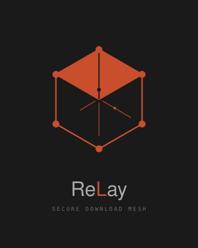

# ReLay

<p align="center">
  <picture>
    <source media="(prefers-color-scheme: dark)"  srcset="src/assets/relay-dark.svg">
    <source media="(prefers-color-scheme: light)" srcset="src/assets/relay-light.svg">
    
  </picture>
</p>

[](https://github.com/Justin-Panangos/ReLay/releases/latest)
[](https://justin-panangos.github.io/ReLay/privacy)

**[Download for macOS](https://github.com/Justin-Panangos/ReLay/releases/latest)** · **[Download for Windows](https://github.com/Justin-Panangos/ReLay/releases/latest)** · **[Download for Linux](https://github.com/Justin-Panangos/ReLay/releases/latest)**

A cross-platform desktop download manager built with Rust and Tauri. ReLay combines fast parallel chunked downloads, full torrent support, smart queue management, and a 7-layer virus scanner (ReLay Shield) backed by a decentralised threat intelligence network on the Internet Computer Protocol (ICP).

---

## Features

### Core Downloads
- HTTP/HTTPS downloads with parallel chunking (16 chunks free / 32 Pro)
- HTTP/2 multiplexing via reqwest
- Pause, resume, and cancel at any point
- Per-download bandwidth cap (Pro: set a live kbps limit per download)
- Auto-retry on network failure, up to 4 attempts with exponential backoff (5s → 10s → 20s → 40s)
- Magnet link and .torrent file support (DHT + PEX peer discovery)
- UPnP port forwarding for inbound peer connections (port 6881)
- Drag-and-drop URLs and .torrent files

### Queue Management
- Sequential chaining: queued downloads start automatically when a slot opens
- Drag-and-drop queue reorder (Pro)
- Time-window scheduling: set a start/end time and downloads pause/resume automatically (Pro)

### ReLay Shield
- Layer 1: Hash reputation (VirusTotal)
- Layer 2: YARA rules scan
- Layer 3: Entropy analysis (detects packed/encrypted payloads)
- Layer 4: File type mismatch detection
- Layer 5: URL/IP reputation
- Layer 6: Static binary heuristics
- Layer 7: Sandbox behavioural analysis - macOS (`sandbox-exec`), Linux (network namespace), Windows (Job Objects) - Pro, opt-in

### Decentralised Threat Network (ICP)
- Signature database synced every 12 hours from ICP Pattern Canister
- Pseudonymous zero-day submission, attributed to your device's cryptographic principal
- DAO voting for community threat review (Pro, opt-in)
- Public Threat Intelligence API for developers and researchers

### Browser Extension (Chrome / Firefox)
- Intercepts downloads and routes them through the desktop app
- Live download progress in the extension popup
- Smart popup blocking: suppresses timed overlays and close-button redirect traps
- Block popups toggle in the extension popup

### Pro Tier ($5/month)
- Unlimited simultaneous HTTP downloads
- 32 parallel chunks per download
- Per-download bandwidth limit (live, adjustable mid-download)
- Drag-and-drop queue reorder
- Time-window download scheduling
- Sandbox scanning (Layer 7)
- Download history: 50 entries
- ICP Shield DAO voting rights

---

## Status & Contributing

ReLay is actively developed and not yet production-ready. Core download, torrent, and Shield scanning are functional, but the project is still maturing with rough edges and limited test coverage.

**Contributors are welcome.** If you're interested in helping, good places to start:

- **Tests**: unit and integration coverage for chunked downloads, Shield layers, and the Cloudflare Worker
- **Windows / Linux testing**: most development has been on macOS; bug reports and fixes on other platforms are very valuable
- **UI polish**: the interface is functional but unrefined; accessibility improvements and UX tweaks are appreciated
- **Documentation**: inline code comments, architecture write-ups, and contributor guides

To get started, see [Building From Source](#building-from-source) below. Open issues are tracked on GitHub at [Justin-Panangos/ReLay/issues](https://github.com/Justin-Panangos/ReLay/issues).

---

## Tech Stack

| Layer | Technology |
|---|---|
| Desktop framework | Tauri v1 |
| Backend language | Rust |
| Async runtime | Tokio |
| HTTP client | Reqwest + HTTP/2 |
| Torrent engine | librqbit |
| Local database | SQLite (rusqlite) |
| Virus scanning | yara-rs, goblin, infer, memmap2, sha2 |
| Scheduling | chrono |
| ICP canisters | ic-cdk, ic-agent, candid |
| Payments | Paystack + Cloudflare Workers |
| Frontend | HTML + CSS + Vanilla JS |
| Browser extension | Chrome/Firefox Manifest V3 |
| Build tool | Vite |

---

## Building From Source

### Prerequisites

- Rust (stable, via rustup): `rustup update stable`
- Node.js 20+
- Tauri CLI: `cargo install tauri-cli`

**macOS:**
```bash
xcode-select --install
brew install yara
```

**Linux (Debian/Ubuntu):**
```bash
sudo apt install libwebkit2gtk-4.0-dev libssl-dev libgtk-3-dev \
  libayatana-appindicator3-dev librsvg2-dev libyara-dev
```

**Windows:** Microsoft C++ Build Tools (Visual Studio installer)

### Run in Development

```bash
npm install
npm run tauri dev
```

### Build for Release

```bash
npm run tauri build
```

Outputs to `src-tauri/target/release/bundle/`.

---

## Getting Started: Full Stack Verification

This section walks through running and verifying the complete stack end to end.

### Step 1: Prerequisites

Follow the platform-specific steps in **Building From Source** above, then come back here.

### Step 2: Config file

The app reads canister IDs and the worker URL from a `config.toml` at the project root. This file is gitignored (it holds deployment credentials). Create it now:

```bash
cp config.toml.example config.toml
```

Then open `config.toml` and fill in the live values:

```toml
icp_url    = "https://ic0.app"
worker_url = "https://relay-worker.<subdomain>.workers.dev"

[canisters]
pattern    = "byq2x-tqaaa-aaaao-qpsaq-cai"
governance = "wf57k-faaaa-aaaao-qpr7q-cai"
identity   = "b7r4d-6iaaa-aaaao-qpsaa-cai"
update     = "brtrl-fyaaa-aaaao-qpsba-cai"
```

The canister IDs above are the live mainnet deployments. The `worker_url` is available from the seller on request.

### Step 3: Run in development

```bash
npm install
npm run tauri dev
```

The app window opens in roughly 30 seconds on first compile (Rust cold build). Subsequent runs are fast.

### Step 4: What you can test without any credentials

These features work immediately with no API keys or accounts:

| Feature | How to test |
|---|---|
| HTTP downloads | Paste `https://proof.ovh.net/files/10Mb.dat` and click Start |
| Chunked parallel download | Watch the download card; speed should exceed a single-connection browser download |
| Pause / resume / cancel | Use the controls on any active download card |
| Torrent (magnet link) | Paste any public-domain magnet link (e.g. Debian ISO) |
| Queue management | Start multiple downloads; they chain automatically |
| Shield layers 2-4 | Download any file; YARA, entropy, and file-type checks run automatically, no key needed |
| EICAR virus test | Download `https://www.eicar.org/download/eicar.com`; Shield should quarantine it |
| Quarantine tab | Quarantined files appear here with restore/delete options |
| Dark/light theme | Follows OS theme automatically |
| Settings | All toggles and preferences persist via SQLite |

### Step 5: What requires credentials

| Feature | Credential needed | How to get it |
|---|---|---|
| Shield Layer 1 (hash check) | VirusTotal API key | Free at virustotal.com (500 lookups/day) |
| Shield Layer 5 (URL reputation) | Same VirusTotal key | Add to Settings → Shield → VirusTotal API Key |
| ICP pattern sync | `config.toml` with canister IDs | Use the values in Step 2 |
| Pro features | Paystack test subscription | Use Paystack test mode; request test credentials from seller |
| Cloudflare Worker endpoints | `worker_url` in `config.toml` | Available from seller on request |

### Step 6: Verifying the ICP integration

With `config.toml` populated, the app syncs with the ICP Pattern Canister on startup and every 12 hours. To verify it's working:

1. Open **Settings → Shield**; the ICP sync status should show a timestamp
2. Open **Settings → Pro**; the Identity Canister will return `Free` for any unregistered device (expected)
3. The governance canister can be queried directly: `dfx canister call wf57k-faaaa-aaaao-qpr7q-cai get_proposals '()' --network ic`

### Step 7: Browser extension

The extension communicates with the desktop app via native messaging. This requires a manifest file placed in a platform-specific OS location. Setup is currently manual (the production installer will handle this automatically):

**macOS:**
```bash
cp extension/host/com.relay.native.json \
  ~/Library/Application\ Support/Google/Chrome/NativeMessagingHosts/
```

**Linux:**
```bash
cp extension/host/com.relay.native.json \
  ~/.config/google-chrome/NativeMessagingHosts/
```

**Windows:** Add the JSON path to `HKCU\Software\Google\Chrome\NativeMessagingHosts\com.relay.native` in the registry.

Once placed, load the extension unpacked in Chrome (`chrome://extensions` → Load unpacked → select the `extension/` folder). Right-click any download link → "Download with ReLay".

### Step 8: Architecture walkthrough

For a technical deep-dive, the entry points are:

| Area | Start here |
|---|---|
| Rust backend entry point | `src-tauri/src/main.rs` |
| Download engine | `src-tauri/src/download/mod.rs` |
| Shield pipeline | `src-tauri/src/shield/mod.rs` |
| ICP agent | `src-tauri/src/icp/mod.rs` |
| Pro feature gating | `src-tauri/src/pro/mod.rs` |
| Cloudflare Worker | `worker/index.js` |
| ICP canisters | `icp/pattern/src/lib.rs`, `icp/identity/src/lib.rs` |
| Frontend entry | `src/index.html`, `src/scripts/main.js` |

---

## Project Structure

```
relay/
├── src-tauri/          # Rust backend
│   └── src/
│       ├── main.rs     # Entry point + Tauri command registration
│       ├── commands/   # Tauri IPC bridge (thin command wrappers)
│       ├── db/         # SQLite layer + migrations
│       ├── download/   # HTTP chunked download engine
│       ├── torrent/    # Torrent engine (librqbit wrapper)
│       ├── shield/     # ReLay Shield scan pipeline
│       ├── icp/        # ICP agent + canister calls
│       └── pro/        # Licence checking + feature gating
├── src/                # Frontend (vanilla HTML/CSS/JS)
│   ├── index.html
│   ├── styles/
│   └── scripts/
├── icp/                # ICP canister source (Rust)
│   ├── pattern/        # Threat signature database
│   ├── governance/     # DAO voting + reputation
│   ├── identity/       # Pro licences + API keys
│   └── update/         # App version tracking
├── worker/             # Cloudflare Worker (payments + API)
└── extension/          # Browser extension (Chrome + Firefox)
```

---

## Torrent Networking Notes

ReLay uses UPnP to automatically open an inbound port (6881) on your router, which allows peers to connect to you directly and significantly improves download speeds.

**If speeds are still slow:**

- **Strict NAT or corporate firewall**: UPnP won't work. Manually forward TCP/UDP port 6881 on your router.
- **macOS firewall**: Allow ReLay through `System Settings → Privacy & Security → Firewall`.
- **Router with UPnP disabled**: Enable UPnP in your router admin panel (usually under Advanced → NAT or WAN settings).
- **Low-seeder torrent**: If the torrent itself has very few seeders, speeds will be limited regardless of network configuration.

---

## Platforms

| Platform | Installer |
|---|---|
| Windows | `ReLay_x64-setup.exe` |
| macOS | `ReLay_x64.dmg` |
| Linux | `ReLay_amd64.AppImage`, `ReLay_amd64.deb` |

---

## Licence

Proprietary. All rights reserved.
